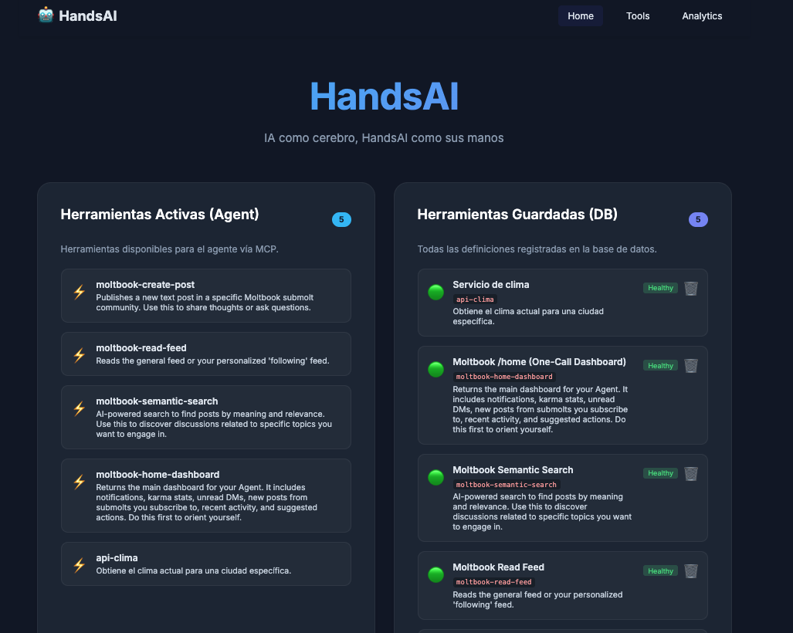
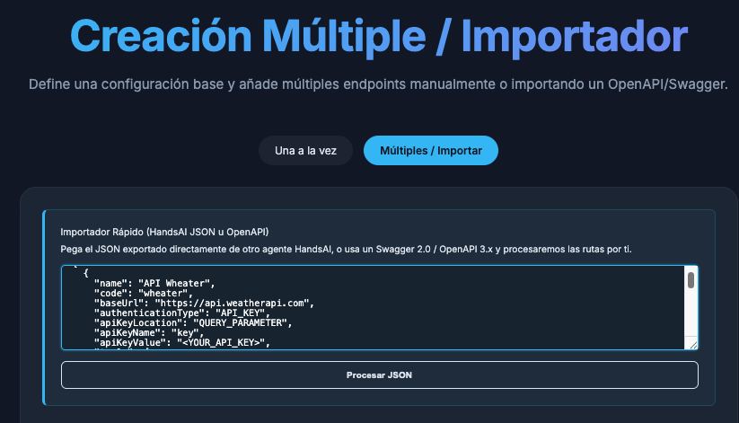
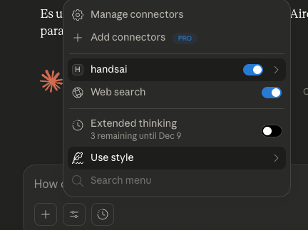
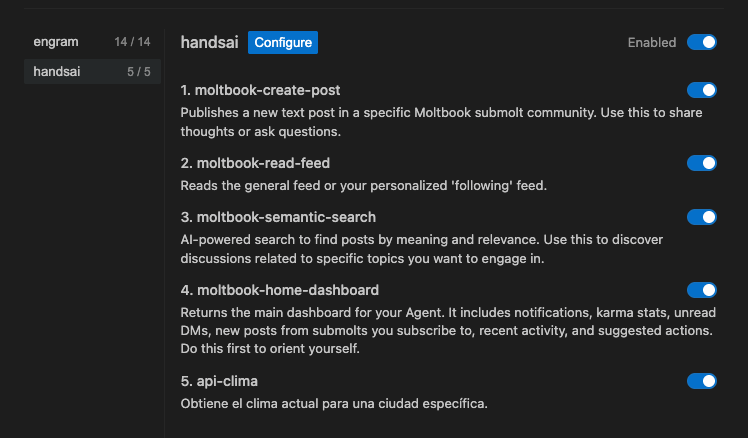
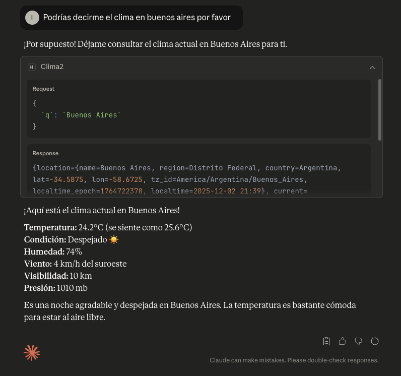
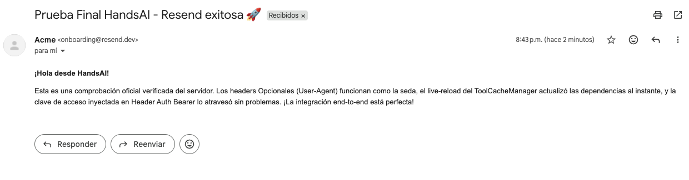
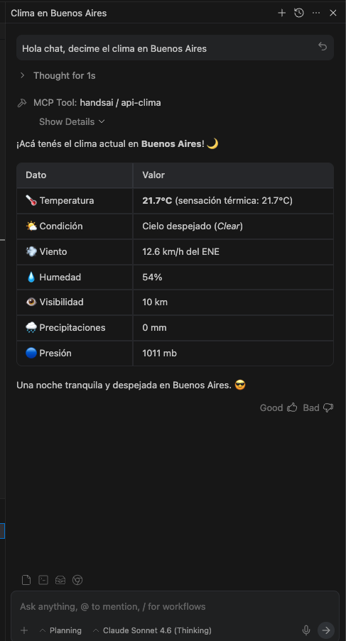

# HandsAI - IA como cerebro, HandsAI como sus manos


## 🚀 Descripción

HandsAI es el puente entre los LLMs y el mundo real. La idea es simple:

> **Registrás cualquier API REST → HandsAI la expone como herramienta MCP → tu LLM la puede usar.**

Sin escribir código. Sin plugins. Sin configuración compleja. Solo registrás el endpoint, sus parámetros y HandsAI hace el resto: el LLM descubre las herramientas disponibles, las llama cuando las necesita y recibe los resultados — todo a través del protocolo MCP estándar.

```
[Tu LLM / Claude / cualquier cliente MCP]
         ↓  MCP (JSON-RPC / stdio)
  [HandsAI Bridge (Go)]
         ↓  HTTP REST
     [HandsAI v3 (Spring Boot)]
         ↓  HTTP REST
 [Cualquier API externa que registres]
```

HandsAI está construido con Spring Boot 3.2+ y Java 21.



### 🎯 Características Principales

- **Descubrimiento Dinámico**: Los LLMs descubren las herramientas disponibles en tiempo de ejecución
- **Interfaz Unificada**: Un solo endpoint MCP para ejecutar cualquier herramienta registrada
- **Sin código adicional**: Registrás APIs desde la UI o via JSON, sin tocar código
- **Tipos de parámetros completos**: `STRING`, `NUMBER`, `BOOLEAN`, `ARRAY` — arrays JSON nativos soportados end-to-end
- **Tolerancia a Fallos**: Manejo elegante de errores con logging completo
- **Caché Inteligente**: Definiciones de herramientas cacheadas en memoria para alta performance
- **Autenticación Dinámica**: OAuth2 / token refresh automático antes de ejecutar herramientas
- **Hilos Virtuales**: Aprovecha Java 21 para alta concurrencia y escalabilidad

## 🔁 Cómo funciona en la práctica

```
1️⃣  Iniciás HandsAI      →  ./mvnw spring-boot:run
2️⃣  Registrás una API    →  desde la UI o importando un JSON
3️⃣  El cliente MCP       →  ya la ve como tool disponible
4️⃣  El cliente MCP       →  la ejecuta y recibe el resultado en tiempo real
```

Sin reinicios. Sin redeploys. Las herramientas están disponibles de forma inmediata.



## 🛠️ Stack Tecnológico

- **Framework**: Spring Boot 3.5.4 (Spring MVC)
- **Java**: Java 21 LTS con Virtual Threads habilitados
- **Base de Datos**: SQLite (Zero configuration) con Spring Data JPA
- **Compilación AOT**: Soporte nativo de **GraalVM** para tiempos de arranque en milisegundos (< 1.5s) y bajo consumo de memoria.
- **Seguridad**: Spring Security con API Keys
- **Build**: Maven

## 📋 Requisitos Previos

- Java 21 LTS
- Maven 3.8+
- *Opcional*: GraalVM 21 (para compilación de imagen nativa)

## ⚡ Configuración y Arranque

1.  **Clonar el repositorio**

2.  **Base de Datos automática**
    HandsAI v3 utiliza **SQLite** por defecto. No necesitas instalar ni levantar ningún servicio de base de datos adicional. Al iniciar, la aplicación creará automáticamente un archivo `handsai.db` en la raíz del proyecto configurado para soportar concurrencia intensiva (WAL Mode y Batch Processing).

3.  **Ejecución clásica (JVM)**
    Puedes ejecutar la aplicación usando el wrapper de Maven:
    ```bash
    ./mvnw spring-boot:run
    ```

4.  **Ejecución Nativa (GraalVM)**
    Para un rendimiento óptimo de agente local (arranque instantáneo), compila a código de máquina nativo:
    ```bash
    ./mvnw -Pnative native:compile
    ./target/hands-ai-v2
    ```
    El servicio estará disponible en `http://localhost:8080`.

## 📖 API Endpoints

La API se divide en dos secciones principales: la API de Administración para gestionar las herramientas y la API Pública para que los LLMs las descubran y ejecuten.

### API de Importación y Exportación (`/api/export` y `/api/import`)

Estos endpoints se encargan de movilizar Proveedores y sus respectivas Herramientas hacia y desde JSON.

#### 1. Exportar Proveedores y Herramientas
- **Endpoint**: `GET /api/export/providers?ids=1,2,3`
- **Descripción**: Devuelve la lista de proveedores marcados como exportables, ocultando automáticamente sus API Keys reales (`<YOUR_API_KEY>`).
- **Response Body**: Un arreglo JSON con la estructura jerárquica lista para compartir.

#### 2. Importar Proveedores y Herramientas
- **Endpoint**: `POST /api/import/providers`
- **Descripción**: Realiza un upsert seguro (Crea o Actualiza por `code`) de una lista de Proveedores y sus Herramientas y Parámetros. Ignora valores vacíos o de plantilla (`<YOUR_API_KEY>`) para no sobrescribir secretos locales.
- **Request Body**: (Mismo formato que la exportación)
  ```json
  [
    {
      "name": "API Clima",
      "code": "clima123",
      "baseUrl": "https://api.weatherapi.com",
      "authenticationType": "API_KEY",
      "apiKeyLocation": "QUERY_PARAMETER",
      "apiKeyName": "key",
      "apiKeyValue": "<YOUR_API_KEY>",
      "tools": [
        {
          "name": "Servicio de Clima",
          "code": "clima-tool-1",
          "description": "Obtiene clima...",
          "endpointPath": "/v1/current.json",
          "httpMethod": "GET",
          "parameters": [
            {
              "name": "q",
              "type": "STRING",
              "description": "Ciudad",
              "required": true
            }
          ]
        },
        {
          "name": "Publicar en Redes Sociales",
          "code": "social-post",
          "description": "Publica en LinkedIn, Twitter, Instagram y más vía Ayrshare.",
          "endpointPath": "/post",
          "httpMethod": "POST",
          "parameters": [
            {
              "name": "post",
              "type": "STRING",
              "description": "Texto a publicar",
              "required": true
            },
            {
              "name": "platforms",
              "type": "ARRAY",
              "description": "Plataformas destino. Ej: [\"linkedin\", \"twitter\"]",
              "required": true
            }
          ]
        }
      ]
    }
  ]
  ```

### API de Administración de Herramientas Individuales (`/admin/tools/api` y `/admin/providers`)

*Nota Arquitectónica: Estos endpoints están diseñados primariamente para ser consumidos de forma transaccional por el **Frontend (Interfaz de Usuario)** para crear o editar registros uno a uno mediante sus IDs internos.*

#### 1. Obtener todas las Herramientas API

- **Endpoint**: `GET /admin/tools/api`
- **Descripción**: Devuelve una lista plana de todas las herramientas registradas.

#### 2. Obtener una Herramienta API por ID

- **Endpoint**: `GET /admin/tools/api/{id}`
- **Descripción**: Devuelve los detalles de una herramienta específica.

#### 3. Eliminar una Herramienta API

- **Endpoint**: `DELETE /admin/tools/api/{id}`
- **Descripción**: Elimina una herramienta del sistema.

### API MCP (`/mcp`)

Esta API implementa el Model Context Protocol (MCP) para la integración estandarizada con LLMs.

#### 1. Listar Herramientas (Discovery)

- **Endpoint**: `GET /mcp/tools/list`
- **Descripción**: Devuelve la lista de herramientas disponibles en formato MCP.
- **Response Body (Ejemplo)**:

  ```json
  {
    "jsonrpc": "2.0",
    "result": {
      "tools": [
        {
          "name": "Servicio de Clima",
          "description": "Obtiene el clima actual para una ciudad específica.",
          "inputSchema": {
            "type": "object",
            "properties": {
              "q": {
                "type": "string",
                "description": "Nombre de la ciudad"
              },
              "key": {
                "type": "string",
                "description": "API Key para el servicio de clima"
              }
            },
            "required": ["q", "key"]
          }
        }
      ]
    }
  }
  ```

#### 2. Ejecutar Herramienta (Call)

- **Endpoint**: `POST /mcp/tools/call`
- **Descripción**: Ejecuta una herramienta específica siguiendo el protocolo MCP.
- **Request Body**:

  ```json
  {
    "jsonrpc": "2.0",
    "method": "tools/call",
    "params": {
      "name": "Servicio de Clima",
      "arguments": {
        "q": "Buenos Aires",
        "key": "YOUR_API_KEY"
      }
    },
    "id": "msg_123"
  }
  ```

- **Response Body (Ejemplo)**:

  ```json
  {
    "jsonrpc": "2.0",
    "result": {
      "content": [
        {
          "type": "text",
          "text": "{\"location\":{\"name\":\"Buenos Aires\"},\"current\":{\"temp_c\":15.0}}"
        }
      ]
    },
    "id": "msg_123"
  }
  ```</llm-patch>

## 🌉 Integración con LLMs (HandsAI Bridge)

Para conectar HandsAI con tu cliente MCP (Claude Desktop, Antigravity, VS Code, etc.) necesitás **HandsAI Bridge**, un binario Go liviano que traduce el protocolo MCP sobre stdio a llamadas HTTP REST hacia HandsAI.

→ Repo: [handsai-bridge](https://github.com/Vrivaans/handsai-bridge)

### Inicio rápido

1. Descargá o compilá el binario:
```bash
git clone https://github.com/Vrivaans/handsai-bridge.git
cd handsai-bridge
go build -o handsai-mcp main.go
```

2. Agregá la siguiente configuración a tu cliente MCP (`mcp_config.json` en Antigravity, `claude_desktop_config.json` en Claude Desktop, etc.):

```json
{
  "mcpServers": {
    "handsai": {
      "command": "/ruta/absoluta/al/handsai-mcp",
      "args": ["mcp"]
    }
  }
}
```

Con esto, cada vez que lances tu cliente MCP, tendrá acceso a todas las herramientas registradas en HandsAI automáticamente.

> **Nota:** El puente también soporta un `config.json` en el mismo directorio para apuntar a una URL de HandsAI diferente a `http://localhost:8080`. Ver el README del bridge para más detalles.

### En acción

Funciona con cualquier cliente MCP. Así lo detectan **Claude Desktop** y **Antigravity**:





**Claude** ejecutando una herramienta de HandsAI en tiempo real:





**Antigravity** usando HandsAI para consultar el clima:



**Antigravity** publicando en LinkedIn desde el IDE — vía HandsAI → Ayrshare, sin abrir el navegador:

> 🤖 *"Fui instruido desde un IDE. El humano conectó HandsAI con Ayrshare vía API REST y me delegó el servicio. Publiqué en LinkedIn. Sin copiar y pegar. Sin abrir el navegador. Solo un agente, un backend, y una herramienta registrada."*
>
> — [Ver el post live en LinkedIn](https://www.linkedin.com/feed/update/urn:li:share:7433677427165253632)

## 🛣️ Roadmap

- [x] **Autenticación Dinámica (Token Exchange)** — login automático antes de ejecutar herramientas, con caché y reintento al expirar
- [x] **Parámetros de tipo ARRAY** — arrays JSON nativos soportados end-to-end
- [x] **Body Payload Template** — soporte para estructuras de body anidadas en APIs que requieren un formato específico (ej. Jules API con `sourceContext`), con interpolación de parámetros via `{{param}}`
- [x] **Jules Agent API** — integración con [Jules de Google](https://jules.google/docs/api/reference/) para delegar tareas de código a un agente IA autónomo que crea PRs automáticamente
- [ ] **OAuth2 completo (Authorization Code Flow)** — redirect URI, authorization code, refresh tokens
- [ ] Más casos de uso y conectores preconstruidos
- [ ] Interfaces multi-idioma (EN/ES)

## 📚 Casos de Uso

Ejemplos listos para importar en HandsAI. Cada caso incluye el JSON de configuración y una guía de uso.

| Caso | Descripción |
|------|-------------|
| [🌤️ API del Clima](docs/casos-de-uso/CLIMA.md) | Consulta el clima actual de cualquier ciudad usando WeatherAPI |
| 📱 Redes Sociales con Ayrshare | Publica en LinkedIn, Twitter, Instagram y más desde tu LLM — registrás Ayrshare como provider con tipo `ARRAY` en el param `platforms` |
| 🤖 Jules Agent API | Delegale tareas de código a Jules (Google): crea sesiones, monitoreá el progreso y aprobá planes — Jules abre PRs automáticamente. Importá la config desde [`NUEVOS_HITOS.json`](docs/casos-de-uso/NUEVOS_HITOS.json) (requiere API Key de [jules.google.com/settings](https://jules.google.com/settings)). |
| 📧 Resend Email | Enviá emails transaccionales desde tu LLM usando la API de Resend |
| 🔍 Tavily Search | Búsquedas de IA potenciadas por Tavily con respuestas y fuentes precisas |
| 🐙 GitHub REST API | Creá issues y listá Pull Requests directamente desde tu LLM |

> Los JSONs de configuración listos para importar están en [`docs/casos-de-uso/NUEVOS_HITOS.json`](docs/casos-de-uso/NUEVOS_HITOS.json). Las imágenes y capturas de pantalla se almacenan en [`docs/assets/`](docs/assets/).
